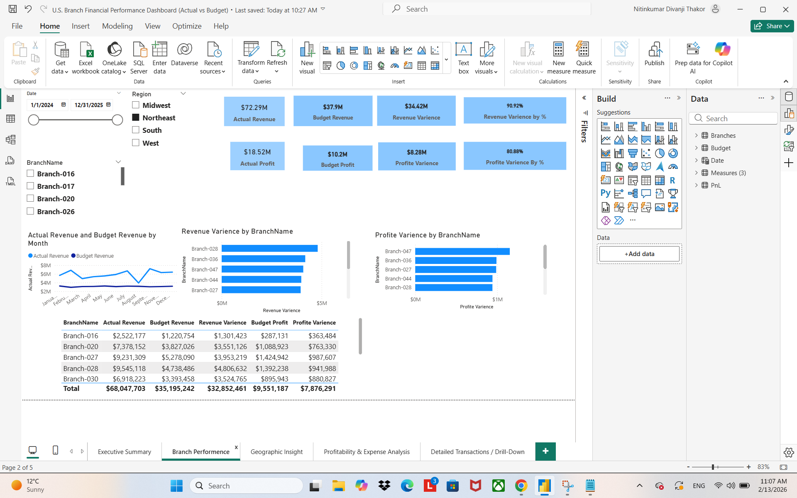

 U.S. Branch Financial Performance Dashboard (Actual vs Budget)

This Power BI project analyzes U.S. branch financial performance by comparing "Actual vs Budget" results.  
It supports drill-down analysis by "Region → State → City → Branch", helping identify where revenue, profit, and expenses are over/under budget.

Project Highlights
- Built an interactive Power BI dashboard to track "Actual Revenue, Budget Revenue, Variance, Profit, and Expense"
- Added drill-down filters (Region, State, City, Branch) for detailed performance review
- Created KPI cards and variance % metrics to quickly understand budget gaps
- Designed pages for executive summary, branch performance, geographic insights, profitability, and detailed drill-down

Tools Used
Power BI
DAX Measures
Data modeling & relationships

Dashboard Pages (Screenshots)
Dashboard Pages (Screenshots)

1. Executive Summary

2) Branch Performance

3) Geographic Insight

4) Profitability & Expense Analysis

5) Detailed Transactions / Drill-Down

Files in this Repository
U.S. Branch Financial Performance Dashboard (Actual vs Budget).pdf (exported report)
PNG screenshots for each dashboard page
README documentation

